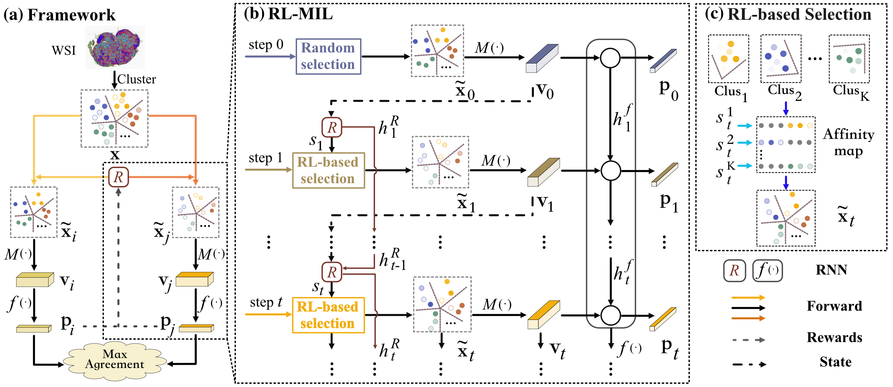

# MuRCL: Multi-instance Reinforcement Contrastive Learning for Whole Slide Image Classification
This repo is the PyTorch implementation for the MuRCL described in the paper "MuRCL: Multi-instance Reinforcement Contrastive Learning for Whole Slide Image Classification". 



## Folder structures

```
│  requirements.yaml
│  train_MuRCL.py  # pre-training MuRCL
│  train_RLMIL.py  # training, fine-tuning and linear evaluating RLMIL 
│          
├─models  # the model's architecture
|      __init__.py
│      abmil.py
│      cl.py
│      clam.py
│      dsmil.py
│      rlmil.py
│      
├─runs  # the training scripts 
│      finetune.sh
│      linear.sh
│      pretrain.sh
│      scratch.sh
│      
├─scripts
│      __init__.py
│      create_heatmaps.py  # generate the attention heat-map mentioned in our paper
│      
├─utils
│      __init__.py
│      datasets.py  # WSI class and function for WSIs
│      general.py   # help function
│      losses.py    # loss function
        
```

## Requirements

requirements.yaml

```yaml
name: MuRCL-pytorch
channels:
  - pytorch
  - conda-forge
  - defaults
dependencies:
  - joblib==0.17.0
  - json-tricks==3.15.5
  - matplotlib==3.1.0
  - opencv-python==4.4.0.46
  - opencv-python-headless==4.5.3.56
  - openslide-python==1.1.2
  - pandas==1.1.4
  - pathtools==0.1.2
  - pytorch=1.7.1=py3.7_cuda11.0.221_cudnn8.0.5_0
  - torchvision=0.8.2=py37_cu110
  - pyyaml==5.3.1
  - scikit-image==0.18.1
  - scikit-learn==0.24.2
  - scipy==1.5.4
  - sklearn==0.0
  - sklearn-pandas==2.0.4
  - tensorboard==2.4.1
  - tqdm==4.53.0

```

## Datasets

### Download

> Camelyon16: https://camelyon16.grand-challenge.org/Download/
>
> TCGA: Use [GDC data portal](https://docs.gdc.cancer.gov/Data_Transfer_Tool/Users_Guide/Getting_Started/) with a manifest file and configuration file.

### WSI Processing

1. `cd wsi_processing`

2. Tile all the WSI into patches

   ```shell
   python create_patches.py --slide_dir /dir/to/silde --save_dir /save/dir/patch --overview --save_mask --wsi_format .tif --overview_level 5
   ```

3. Feature extraction

   ```shell
   python extract_features.py --path_dir /dir/to/patch --image_encoder resnet18 --device 0
   ```

4. Clustering patch features

   ```shell
   python features_clustering.py --feat_dir /dir/to/patch/features --num_clusters 10
   ```


### Data Organization

The format of  input csv file:

|  case_id   |           features_filepath            | label |            clusters_filepath            |          clusters_json_filepath          |
| :--------: | :------------------------------------: | :---: | :-------------------------------------: | :--------------------------------------: |
| normal_001 | /path/to/patch_features/normal_001.npz |   0   | /path/to/cluster_indices/normal_001.npz | /path/to/cluster_indices/normal_001.json |
|    ...     |                  ...                   |  ...  |                   ...                   |                   ...                    |

> **case_id**: [str] the index for each WSI. 
>
> **features_filepath**: [str] the .npz file path for each WSI, this .npz file contains several keywords as follows: 
>
> - filename: [str] case_id. 
> - img_features: [numpy.ndarray] the all patch's features as a numpy.ndarray, the shape is (num_patches, dim_features), like (1937, 512). 
>
> **label**: [int] the label of the WSI. 
>
> **clusters_filepath**: [str] this .npz file indicates the clustering category corresponding to each patch in WSI. It contaions several keywords as follows:
>
> - filename: [str] case_id.
> - features_cluster_indices: [numpy.ndarray] This array represents the clustering category of each patch feature in WSI, it's shape is (num_pathces, 1). 
>
> **clusters_json_filepath**: [str] This JSON file represents the patch index contained in each category of clustering, like:
>
> ```json
> [
>     [0, 30, 57, 58, 89, 113, 124, 131, ...],
>     [11, 13, 22, 25, 26, 34, 35, 45, 49, 50, 51, ...],
>     ...
>     [1, 8, 15, 16, ...]
> ]
> ```
>
> Each list represents a category.

## Pre-training

pre-training our proposed framework MuRCL. 

```shell
cd runs
sh pretrain.sh
```

## Training from scratch, Fine-tuning, and linear evaluation

evaluation of our proposed framework MuRCL. 

```shell
cd runs
# training from scatch, does not load pre-trained weights
sh scratch.sh
# fine-tuning with pre-training weights by MuRCL
sh fintune.sh
# linear evaluation with pre-training weights by MuRCL
sh linear.sh
```

## Visualization

This code could create the attention heat-map mentioned in our paper.

```shell
cd scripts
python create_heatmaps.py
```

 


## Training on your own datasets

1. You can simply process your own dataset into a format acceptable to our code, see [WSI Processing](###WSI Processing) and [Data Organization](###Data Organization). 
2. Then modify the input parameters of the training script in the runs directory. 

